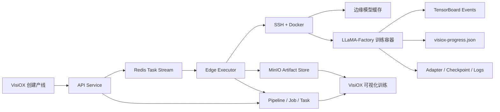

# VisiOX LLaMA-Factory 大模型训练接入方案

## 1. 目标

在现有“创建产线 → 数据准备 → 参数准备 → 提交训练 → 可视化训练 → 模型产物”的产品链路中，增加真正可运行的大模型微调能力，并继续使用 VisiOX 作为任务、资源、状态、日志、指标和产物的唯一管理入口。

第一版生产闭环只承诺：

- 文本大模型监督微调（SFT）。
- 单机单卡 NVIDIA GPU。
- LoRA 和 4-bit QLoRA。
- Hugging Face / ModelScope 公共模型下载与边缘缓存。
- Alpaca 与 ShareGPT/OpenAI messages 数据集。
- 真实停止、失败、重试、断点恢复、日志、指标和模型产物。
- 使用现有 RTX 3060 12GB 节点完成真实验收。

以下能力保留架构入口，但不作为第一版验收项：

- DPO、ORPO、KTO、PPO、Reward Model。
- 全参数微调。
- 多模态模型。
- 单机多卡和多机 DeepSpeed/FSDP。
- 私有模型仓库凭据。
- LoRA 合并、量化和 vLLM/SGLang 部署。

## 2. 核心决定

### 2.1 不把 `http://127.0.0.1:7860/` 当训练 API

本机服务是 `llamafactory-cli webui` 启动的 Gradio 页面。当前没有稳定的命名训练 API，而且本机 LLaMA-Factory 环境是 CPU PyTorch、没有 CUDA。VisiOX 不应通过浏览器自动化或 Gradio `fn_index` 启动生产任务。

正式边界为：

```text
VisiOX 生成并校验训练配置
  -> 边缘执行器拉取固定摘要训练镜像
  -> 边缘节点准备数据集和模型缓存
  -> 容器执行 VisiOX LLM entrypoint
  -> entrypoint 调用 LLaMA-Factory run_exp/CLI
```

本地 WebUI 仅保留为参数参考和独立调试工具。

### 2.2 训练引擎必须成为一等概念

不能把 LLaMA-Factory 参数塞进现有 Ultralytics 参数白名单。平台增加引擎适配层：

```python
class TrainingEngineAdapter(Protocol):
    def validate_pipeline(...): ...
    def resolve_config(...): ...
    def stage_assets(...): ...
    def build_launch_spec(...): ...
    def collect_progress(...): ...
    def collect_artifacts(...): ...
```

首批适配器：

- `ultralytics`：包装现有逻辑，行为不变。
- `llamafactory`：负责 LLM 配置、数据、启动、指标和产物。

引擎适配只能产生结构化启动规范，不能允许前端传任意 Shell 命令。

### 2.3 大模型由边缘端下载并缓存

平台只保存模型引用、revision、元数据和校验清单，不在平台主机保存几十 GB 的完整基础模型。

边缘端模型缓存：

```text
~/.local/share/visiox/model-cache/
  huggingface/
  modelscope/
```

训练容器挂载该缓存。第一次运行下载，后续任务复用。模型必须固定 revision/commit；训练记录保存实际解析出的 revision 和文件清单摘要，保证可复现。

## 3. 总体架构



## 4. 数据模型调整

通过正式数据库迁移增加字段，禁止只依赖 `create_all` 改线上结构。

### 4.1 `base_models`

新增：

- `engine`: `ultralytics | llamafactory`，默认 `ultralytics`。
- `model_format`: `pytorch_single | hf_snapshot | hf_reference`。
- `metadata`: JSON，保存模型 ID、来源、revision、架构、参数量、默认模板、许可证、是否需要 `trust_remote_code`。

LLM 模型示例：

```json
{
  "engine": "llamafactory",
  "family": "Qwen3",
  "task": "llm",
  "scale": "0.6b",
  "source_path": "Qwen/Qwen3-0.6B",
  "model_format": "hf_reference",
  "metadata": {
    "hub": "huggingface",
    "revision": "resolved-commit-sha",
    "template": "qwen3",
    "license": "recorded-from-model-card"
  }
}
```

### 4.2 `datasets`

新增：

- `format`: `yolo | alpaca | sharegpt | openai_messages | preference`。
- `schema_config`: JSON，保存字段映射、角色标签和 stage 兼容性。
- `manifest_checksum`: 不可变训练数据清单摘要。

LLM 数据集仍使用 `storage_uri` 指向 JSON/JSONL/Parquet 产物；`DatasetSample` 可以保存每条记录的 URI/校验和，但不再使用图像宽高语义。

### 4.3 `training_pipelines`

新增：

- `engine`: 默认 `ultralytics`。
- `recipe`: JSON，保存结构化 LLM 配置，避免和 YOLO 平铺参数混用。

### 4.4 `training_jobs`

新增或在不可变 Job 快照中固化：

- `engine`、`engine_version`。
- `resolved_config`。
- `config_uri`、`config_checksum`。
- 实际模型 revision、数据集 manifest checksum、训练镜像 digest。

`TrainedModel` 第一版仍保存一个主产物，但其 `artifact_uri` 指向适配器压缩包；检查点、日志、事件文件和图表继续放在通用训练产物列表中。

## 5. 创建产线前端流程

继续使用现有四步页面，不新建第二套大模型产品。

完整页面结构、字段、交互状态、组件拆分和响应式验收见：

`docs/superpowers/plans/2026-07-24-llamafactory-frontend.md`

### 第一步：选择产线

点击“大模型训练”后立即创建：

```json
{
  "task": "llm",
  "engine": "llamafactory",
  "status": "draft"
}
```

只要没有提交训练，模型空间保持“配置中”。

### 第二步：数据准备

页面分成“基础模型”和“训练数据集”。

基础模型：

- 模型来源：Hugging Face / ModelScope / 本地模型包。
- 模型 ID，例如 `Qwen/Qwen3-0.6B`。
- Revision：默认解析为不可变 commit，用户可指定 tag/commit。
- 对话模板：系统自动识别，允许高级用户覆盖。
- 模型卡信息：参数量、架构、许可证、是否需要远程代码。

训练数据集：

- 只显示 `task=llm` 且通过校验的数据集。
- 支持 JSON、JSONL、CSV、Parquet。
- 自动识别 Alpaca、ShareGPT、OpenAI messages。
- 展示对话预览、有效/无效样本数、空响应、角色错误、长度分布。
- 根据所选 tokenizer 展示 token 长度分布和预计截断比例。
- SFT 必须包含可训练 assistant 响应；偏好阶段后续要求 chosen/rejected。

系统生成隔离目录中的 `dataset_info.json`，用户不填写文件路径。

### 第三步：参数准备

#### 基本配置

| 页面字段 | LLaMA-Factory 字段 | 第一版规则 |
|---|---|---|
| 训练阶段 | `stage` | 固定 `sft` |
| 微调方法 | `finetuning_type` | `lora`；选择 QLoRA 时仍为 `lora` |
| 量化等级 | `quantization_bit` | `none` 或 `4` |
| 量化方法 | `quantization_method` | QLoRA 默认 `bitsandbytes` |
| 对话模板 | `template` | 自动检测，可覆盖 |
| 学习率 | `learning_rate` | 默认 LoRA `1e-4`、QLoRA `1e-4` |
| 训练轮数 | `num_train_epochs` | 默认 3 |
| 截断长度 | `cutoff_len` | 默认 1024/2048，受显存预检约束 |
| 单卡批量 | `per_device_train_batch_size` | 默认 1 |
| 梯度累积 | `gradient_accumulation_steps` | 默认 8 |
| 验证集比例 | `val_size` | 默认 0.1 |
| 学习率调度 | `lr_scheduler_type` | 默认 `cosine` |
| 热身比例 | `warmup_ratio` | 默认 0.1 |
| 精度 | `bf16` / `fp16` | 根据 GPU 自动选择 |

#### 高级配置

- `lora_rank`、`lora_alpha`、`lora_dropout`、`lora_target`。
- `max_grad_norm`、`seed`、`max_samples`。
- `logging_steps`、`save_steps`、`eval_steps`、`save_total_limit`。
- `gradient_checkpointing`。
- `flash_attn`，硬件不支持时自动回退。
- `rope_scaling`。
- `packing`、预处理/数据加载 worker。
- DeepSpeed 仅在后续多卡阶段开放。
- `resume_from_checkpoint` 由“恢复训练”动作管理，不允许填任意路径。

#### 配置文件模式

提供 YAML 编辑器并与表单双向同步。以下字段由系统锁定或提交时覆盖：

- `model_name_or_path`
- `dataset`、`dataset_dir`
- `output_dir`、`logging_dir`
- `report_to`
- `deepspeed` 文件真实路径
- 分布式环境变量
- `resume_from_checkpoint` 真实路径

配置提交前调用与训练镜像同版本的 LLaMA-Factory `get_train_args()` 做服务端校验，不能只做前端类型检查。

### 第四步：提交训练

复用现有资源池和节点选择：

- 默认选择在线的 x86 NVIDIA 节点。
- 展示 GPU 型号、总显存、空闲显存、磁盘和模型缓存状态。
- 根据模型参数量、微调方法、量化、序列长度和批量给出保守显存估算。
- “自动优化”可以降低 batch、cutoff 或切换 QLoRA；用户可以手动覆盖，但不允许绕过硬性显存不足检查。
- 训练镜像摘要由平台配置，不让普通用户填写。

## 6. 后端 API 与校验

新增或扩展：

```text
GET  /llm/models/catalog
POST /llm/models/resolve
POST /datasets/llm/validate
POST /datasets/llm/preview
POST /pipelines/{id}/llm/config/validate
POST /pipelines/{id}/jobs
```

`POST /pipelines/{id}/jobs` 保持统一入口，根据 `pipeline.engine` 分派：

```text
ultralytics -> 现有 YOLO precheck/worker
llamafactory -> LLM model/dataset/config/resource precheck
```

必须校验：

- 模型来源、revision、模板和 stage 兼容性。
- 数据格式与 stage 兼容性。
- 量化方法与微调方法兼容性。
- bf16/flash-attention 与硬件兼容性。
- 资源池、GPU 数量和显存下限。
- 禁止用户控制系统路径、镜像、任意命令和敏感环境变量。

## 7. 边缘执行与训练镜像

### 7.1 新训练镜像

新增独立镜像：

```text
visiox/llamafactory-training@sha256:<digest>
```

镜像固定：

- LLaMA-Factory commit/version。
- PyTorch/CUDA、Transformers、PEFT、TRL、bitsandbytes。
- VisiOX LLM entrypoint 和进度 callback。
- TensorBoard、资源采样和产物打包工具。

不在现有 YOLO 镜像上继续堆依赖，避免镜像巨大且版本冲突。

### 7.2 Engine-aware staging

LLM stage request 包含：

- `train.yaml`。
- `dataset_info.json` 和训练数据归档。
- 可选断点归档。
- 模型 hub 引用与不可变 revision；不传完整基础模型。

边缘端：

1. 拉取固定摘要训练镜像。
2. 校验配置和数据 SHA-256。
3. 准备训练目录。
4. 挂载持久模型缓存。
5. 容器内下载/校验基础模型 revision。
6. 启动训练。

### 7.3 入口程序

不修改 LLaMA-Factory 源码。新增：

```text
python -m visiox_llm_training_worker.entrypoint /workspace/config/train.yaml
```

入口程序：

- 读取并再次校验受控 YAML。
- 注册 `VisioxTrainerCallback`。
- 调用 `llamafactory.train.tuner.run_exp(args, callbacks=[...])`。
- 原子写入 `visiox-progress.json`。
- 捕获 SIGTERM，触发安全停止并保留最近检查点。
- 训练结束生成产物 manifest 和 SHA-256。

## 8. 可视化训练

继续使用 VisiOX 原生页面，不嵌入 LLaMA-Factory WebUI。

第一版指标：

- `train.loss`
- `eval.loss`
- `learning_rate`
- `grad_norm`
- `epoch`
- `train.tokens_per_second`
- `train.samples_per_second`
- GPU 利用率、显存、CPU、内存

数据源优先级：

1. `visiox-progress.json`：状态和当前进度。
2. TensorBoard events：标量曲线。
3. `trainer_log.jsonl` / `trainer_state.json`：故障兜底。

现有可视化接口保留，前端根据 `engine` 加载不同指标目录。CV 的 mAP/Recall 不出现在 LLM 训练中，LLM 的 loss/tokens per second 也不混到 CV 指标组。

## 9. 训练产物

LoRA/QLoRA 成功后保存：

- `adapter_model.safetensors`
- `adapter_config.json`
- tokenizer/config 相关文件
- `training_args.yaml`
- `trainer_state.json`
- `trainer_log.jsonl`
- TensorBoard events
- loss 图和评估结果
- 最近检查点（按保留策略）
- `artifact-manifest.json`

主模型产物打包为 `adapter.tar.zst` 并登记到 `TrainedModel`。断点包独立登记，恢复训练时通过受控 artifact URI 挂载，不能使用用户输入的任意主机路径。

第一版不自动合并 LoRA 与基础模型，避免生成额外的大体积模型。后续“导出/部署”步骤单独执行合并、量化或 vLLM LoRA 服务化。

## 10. 安全与可复现性

- 所有运行镜像使用不可变 digest。
- 模型使用不可变 revision；记录最终 resolved commit。
- 数据集使用 manifest checksum。
- 记录完整 resolved YAML，但对 token/密钥脱敏。
- `trust_remote_code` 默认关闭；需要时显示风险提示并按模型白名单开启。
- 模型仓库 token 不写进任务 JSON、日志或命令行。
- 容器不挂载 Docker socket，不使用 privileged。
- 对模型和数据记录许可证来源与用户确认；LLaMA-Factory 的 Apache-2.0 不替代模型许可证。

## 11. 实施顺序

### Phase A：引擎与数据契约

- 建立数据库迁移机制和上述字段。
- 抽取 `TrainingEngineAdapter`。
- 让现有 Ultralytics 适配器回归通过。
- 实现 LLM 模型引用、数据格式和参数校验。

主要文件：

- `packages/visiox-db/src/visiox_db/models/model_space.py`
- `packages/visiox-db/src/visiox_db/models/datasets.py`
- `apps/api-service/src/visiox_api/routes/pipelines.py`
- `apps/api-service/src/visiox_api/routes/training_jobs.py`
- 新增 `packages/visiox-llm/`

### Phase B：LLM 数据和模型目录

- 增加 Hub 模型登记/解析。
- 增加 LLM 数据上传、格式识别、校验、预览和 manifest。
- 生成 `dataset_info.json`。
- 前端只显示兼容模型和数据集。

### Phase C：训练镜像和边缘运行

- 新增 LLaMA-Factory 固定版本镜像和 VisiOX entrypoint。
- 泛化 stage/launch/stop/collect 协议。
- 增加边缘模型缓存和下载校验。
- 首先跑通单机单卡。

主要文件：

- 新增 `workers/llm-training-worker/`
- `workers/edge-executor-worker/src/visiox_edge_executor_worker/distributed_execution.py`
- `workers/edge-executor-worker/remote/stage_training.sh`
- `workers/edge-executor-worker/remote/launch_rank.sh`

### Phase D：创建产线与参数页

- 大模型任务进入 task-aware 四步向导。
- 实现结构化参数、YAML 模式、资源预估和自动优化。
- 普通用户不接触模型路径、输出目录和镜像摘要。

### Phase E：可视化、产物、停止与恢复

- 接入 LLM 指标目录和资源指标。
- 收集 adapter/checkpoint/log/events。
- 真实停止、失败收敛、检查点恢复和删除。

### Phase F：真实验收

在 `edge-10-10-13-20` 的 RTX 3060 12GB 上：

1. 登记 `Qwen/Qwen3-0.6B` 的固定 revision。
2. 上传 20-100 条 OpenAI messages/Alpaca SFT 样本。
3. LoRA，cutoff 1024，batch 1，gradient accumulation 4-8，训练 1 Epoch。
4. 确认模型从边缘端下载并进入持久缓存。
5. 确认任务状态、进度、loss、学习率、GPU/显存和日志实时可见。
6. 确认停止任务后保留可恢复检查点。
7. 恢复并训练成功。
8. 下载 adapter 包，重新加载基础模型 + adapter 完成一条真实推理。
9. 重启平台服务后任务、指标、产物仍可查看。

## 12. 第一版完成标准

- 用户从 VisiOX 创建“大模型训练”产线，不需要打开 `7860`。
- 用户不填写本地路径、输出路径、镜像摘要和分布式环境变量。
- 训练真实发生在选中的 RTX 3060 边缘节点。
- 任务中心和模型空间状态与远程容器一致。
- 可视化训练实时展示 LLM 指标与资源使用。
- 训练可停止、失败可解释、检查点可恢复。
- Adapter、配置、日志、事件和校验清单可下载。
- 产物可被重新加载并完成真实推理。
- 现有 YOLO26 训练、评估、部署行为全部回归通过。
