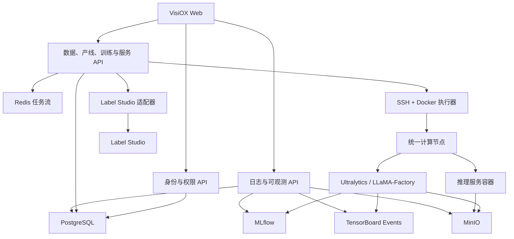

# VisiOX 用户、统一资源与大模型闭环设计

**日期：** 2026-07-27
**状态：** 已确认，可进入分阶段实施
**适用版本：** 单组织第一版

## 1. 目标

本轮建设将现有 VisiOX 从单用户业务界面扩展为具备真实身份、权限、资源管理、日志、数据标注和大模型训练可观测能力的平台。

交付目标包括：

1. 管理员、普通用户、用户组、账户设置和资源授权。
2. 本机、服务器和边缘设备统一纳入计算节点与资源池。
3. 管理员可以管理节点、资源额度和全部业务资源。
4. 停止后的推理服务可以手动恢复，平台重启后能够自动对账。
5. 训练、部署和服务日志具备真实采集、持久化和实时查看能力。
6. 大模型 SFT 数据可以进入 Label Studio 标注并转为不可变训练数据集版本。
7. 大模型训练拥有独立的概览、指标、资源和分析页面。
8. 数据准备、数据集和服务的公开配置由后端权限真正执行。
9. 工作台和管理员统计全部来自实时聚合结果，不保留写死数据。

## 2. 范围边界

### 2.1 第一版包含

- 一个默认组织。
- `admin` 和 `member` 两种系统角色。
- 用户组及组成员管理。
- 用户、用户组和平台公开三种资源授权主体。
- SSH + Docker 节点接入和执行路径。
- 文本大模型 SFT 数据和 LLaMA-Factory 训练。
- MLflow、TensorBoard、MinIO 与 VisiOX 原生可视化页面。
- PostgreSQL、Redis、MinIO 上的现有平台服务。

### 2.2 第一版不包含

- 多组织租户隔离。
- Label Studio 逐用户 SSO。
- DPO、PPO、RLHF 数据标注和训练闭环。
- Kubernetes 调度。
- GPU 分片、抢占和计费系统。
- Loki、Grafana 等额外日志与监控平台。

数据模型保留 `organization_id`，但所有查询在第一版只使用默认组织。

## 3. 总体架构



关键边界：

- 身份权限层只负责身份、角色、资源授权和审计，不包含训练业务规则。
- 节点注册层只负责连接、能力探测、资源池和凭据，不直接决定具体训练参数。
- 远程执行层根据已校验的结构化规范运行 Docker，不接受任意 Shell 命令。
- 可观测层统一读取 MLflow、TensorBoard、MinIO 和进度快照，对前端隐藏来源差异。
- Label Studio 只负责标注交互，VisiOX 负责数据校验、版本和训练契约。

## 4. 身份与权限

### 4.1 数据模型

#### `organizations`

- `id`
- `name`
- `slug`
- `status`
- `created_at`
- `updated_at`

启动迁移时创建唯一默认组织。

#### `users`

- `id`
- `organization_id`
- `username`
- `display_name`
- `email`
- `password_hash`
- `role`: `admin | member`
- `status`: `active | disabled | deleted`
- `must_change_password`
- `last_login_at`
- `created_at`
- `updated_at`

用户名和邮箱在组织内唯一。密码使用 Argon2id 摘要。

#### `user_groups`

- `id`
- `organization_id`
- `name`
- `description`
- `status`
- `created_at`
- `updated_at`

#### `user_group_memberships`

- `id`
- `group_id`
- `user_id`
- `created_at`

`group_id + user_id` 唯一。

#### `user_sessions`

- `id`
- `user_id`
- `refresh_token_hash`
- `expires_at`
- `revoked_at`
- `ip_address`
- `user_agent`
- `created_at`

浏览器内存保存短期访问令牌；刷新令牌只保存于 `HttpOnly`、`SameSite=Lax` Cookie。

#### `resource_grants`

- `id`
- `organization_id`
- `resource_type`
- `resource_id`
- `principal_type`: `user | group | organization`
- `principal_id`
- `permissions`: `view | use | edit | delete | manage | invoke` 的集合
- `expires_at`
- `created_by`
- `created_at`
- `updated_at`

同一资源和授权主体只允许一条有效记录。`organization` 主体表示平台内公开。

#### `resource_allocation_policies`

- `id`
- `organization_id`
- `principal_type`: `user | group`
- `principal_id`
- `resource_pool_id`
- `max_concurrent_training_jobs`
- `max_gpu_count`
- `max_service_instances`
- `expires_at`
- `created_by`
- `created_at`
- `updated_at`

#### `audit_logs`

- `id`
- `organization_id`
- `actor_user_id`
- `action`
- `resource_type`
- `resource_id`
- `result`: `success | denied | failed`
- `request_id`
- `ip_address`
- `metadata`
- `created_at`

审计元数据必须脱敏，不记录密码、Token、私钥和完整环境变量。

### 4.2 业务资源所有权

以下主资源增加 `organization_id`、`owner_user_id` 和 `visibility`：

- `datasets`
- `training_pipelines`
- `training_jobs`
- `trained_models`
- `deployment_services`
- `resource_pools`
- `compute_nodes`

`visibility` 取值：

- `private`: 仅所有者、管理员和显式授权主体。
- `group`: 至少存在一个组授权。
- `public`: 存在组织级授权。

`LabelProject`、`DatasetSample`、`Annotation`、`DeploymentInstance` 和训练产物继承父资源权限，不单独公开。

### 4.3 权限判定

管理员自动拥有默认组织中的所有权限。普通用户满足以下任意条件时获得权限：

1. 是资源所有者。
2. 存在用户级授权。
3. 所属用户组存在授权。
4. 资源存在组织级授权。

后端提供统一依赖：

- `get_current_user`
- `require_admin`
- `require_resource_permission(resource_type, permission)`
- `filter_authorized_resources(query, resource_type, permission)`

私有资源不可见时返回 `404`，可见但操作权限不足时返回 `403`。

### 4.4 默认公开权限

| 资源 | 公开权限 |
|---|---|
| 数据准备 | `view` |
| 数据集 | `view`, `use` |
| 产线 | `view` |
| 服务 | `view`, `invoke` |
| 节点与资源池 | 禁止组织级公开 |

公开服务的用户不能停止、恢复、升级或删除服务。

## 5. 用户与管理界面

### 5.1 左下角账户入口

左侧栏底部显示头像、用户名和角色。菜单包含：

- 个人设置
- 修改密码
- 退出登录
- 用户与权限，仅管理员可见
- 系统统计，仅管理员可见

### 5.2 页面路由

- `/login`
- `/account`
- `/admin/overview`
- `/admin/users`
- `/admin/groups`
- `/admin/resources`
- `/admin/audit-logs`
- `/resources/nodes`

### 5.3 管理能力

管理员可以创建、编辑、禁用、启用和软删除用户，重置一次性密码，修改角色，管理组成员，转移资源所有权和分配资源额度。

删除用户采用软删除。用户历史训练、数据集、服务和审计记录不会被级联删除。

## 6. 统一节点与资源池

### 6.1 节点定义

本机、服务器、边缘设备统一使用现有 `ComputeNode`。设备差异记录在：

- `architecture`
- `platform_kind`
- `capabilities`
- `resources`
- 标签与资源池兼容策略

界面不再以“本机”或“边缘端”作为权限和调度边界。

### 6.2 手动加入节点

管理员输入：

- 节点名称
- SSH Host、Port、User
- 密码或私钥
- 资源池
- 标签

加入流程：

1. 连接 SSH。
2. 获取并确认主机指纹。
3. 探测操作系统、架构、Docker、CPU、内存和磁盘。
4. 探测 NVIDIA GPU、驱动、CUDA 和 TensorRT。
5. 使用现有 AES-GCM 凭据机制加密保存密钥。
6. 写入 `ComputeNode` 和 `EdgeSshCredential`。
7. 进入 `online` 或带原因的 `unavailable` 状态。

第一版不要求节点安装 Agent。

### 6.3 资源刷新与调度

活跃训练或服务节点每 15 秒刷新一次资源，空闲节点每 60 秒刷新一次。资源快照包括：

- CPU 核数和使用率
- 内存总量和使用量
- 磁盘容量和使用量
- GPU 型号、数量、利用率、显存、温度和功耗
- Docker 容器和镜像状态

调度过滤顺序：

1. 用户拥有资源池 `use` 权限。
2. 资源额度允许提交。
3. 节点在线且启用。
4. 架构、GPU、CUDA、显存和磁盘满足任务要求。
5. 当前资源未被互斥任务占用。

## 7. 服务生命周期与恢复

### 7.1 状态模型

服务增加 `desired_state`：

- `running`
- `stopped`

运行状态包括：

- `queued`
- `deploying`
- `running`
- `stopping`
- `stopped`
- `starting`
- `restarting`
- `failed`
- `upgrade_queued`
- `rollback_queued`

### 7.2 操作

- `POST /services/{id}/stop`
- `POST /services/{id}/start`
- `POST /services/{id}/restart`
- `POST /services/{id}/upgrade`
- `POST /services/{id}/rollback`

操作写入持久任务和幂等键。重复请求不得创建重复容器。

### 7.3 可恢复部署规范

服务和实例必须持久保存：

- 节点与实例名称
- 镜像摘要
- 模型产物 URI 与校验和
- TensorRT Engine 信息
- 环境变量白名单
- 端口、挂载和健康检查
- 当前容器 ID
- 最近成功部署 Revision

手动恢复直接复用最近成功 Revision，不要求用户重新填写表单。

### 7.4 平台启动对账

平台启动时：

1. 查询期望运行的服务。
2. 通过 SSH 执行受控 `docker inspect`。
3. 容器存在且健康时恢复 `running`。
4. 容器停止时执行启动。
5. 容器丢失但规范完整时重新创建。
6. 用户主动停止的服务保持 `stopped`。
7. 不可恢复时写入 `failed`、错误码和日志。

## 8. 统一日志

### 8.1 数据模型

#### `log_streams`

- `id`
- `organization_id`
- `resource_type`
- `resource_id`
- `source_type`: `training | deployment | service | remote_execution`
- `status`: `open | closed | failed`
- `started_at`
- `finished_at`
- `retention_until`
- `created_at`

#### `log_chunks`

- `id`
- `log_stream_id`
- `sequence`
- `object_uri`
- `byte_start`
- `byte_end`
- `first_timestamp`
- `last_timestamp`
- `line_count`
- `checksum`
- `created_at`

日志正文保存到 MinIO，PostgreSQL 只保存索引。默认保留 30 天。

### 8.2 日志来源

- 训练容器 `stdout/stderr`。
- LLaMA-Factory、Ultralytics 和框架日志。
- 推理服务 `docker logs`。
- SSH、镜像拉取、模型转换、TensorRT 构建和容器操作日志。
- 健康检查和恢复对账日志。

日志采集前对密码、Token、私钥、Cookie 和敏感环境变量进行脱敏。

### 8.3 查询和实时推送

- 历史日志通过游标分页读取。
- 实时日志通过 SSE 推送。
- 前端支持暂停、跟随、搜索、级别和来源过滤、错误高亮和完整下载。
- SSE 中断后使用最后游标恢复，不丢失已持久化内容。

## 9. 大模型数据与 Label Studio

### 9.1 支持格式

第一版支持 JSON、JSONL、CSV、Alpaca、ShareGPT 和 OpenAI Messages。入库后统一为：

```json
{
  "messages": [
    {"role": "system", "content": "可选系统提示"},
    {"role": "user", "content": "用户问题"},
    {"role": "assistant", "content": "标准回答"}
  ]
}
```

### 9.2 状态流转

```text
imported -> annotating -> partially_labeled -> labeled
         -> syncing -> validated -> converted
```

失败状态保存明确错误和可重试标志。

### 9.3 同步机制

1. 创建 `task=llm` 数据准备记录。
2. 生成 SFT 标注配置并创建 Label Studio 项目。
3. 导入原始样本。
4. 通过 Webhook 接收标注变化。
5. 定时补偿同步遗漏事件。
6. 校验角色顺序、空回答、重复和格式错误。
7. 只将有效标注转换为训练数据集。
8. 生成不可变版本、Manifest 和 SHA-256。

后续标注变化创建新版本，不修改已被训练任务引用的数据集版本。

### 9.4 无密码跳转

用户从 VisiOX 请求短期一次性启动令牌。后端校验数据准备项的权限后，通过 Label Studio 适配器创建受管会话，并重定向到反向代理下的项目地址。管理员凭据和 API Token 不发送到浏览器。

第一版 Label Studio 内使用受管服务身份；VisiOX 审计记录实际操作用户。

### 9.5 数据卡片

数据准备和数据集共用统一卡片结构：

1. 名称。
2. 状态、来源和任务类型。
3. 创建时间和 Label Studio 入口。
4. 样本数、标注数和有效数。
5. 所有者和可见范围。

大模型与视觉数据使用相同元数据行高和对齐规则。

## 10. 大模型训练可视化

### 10.1 数据来源分工

- MLflow：实验、Run、参数、指标历史、状态和产物索引。
- TensorBoard：高频标量和框架原始事件。
- MinIO：事件文件、日志、检查点和训练产物。
- VisiOX：权限校验、来源归一化和原生页面。

每个 MLflow Run 写入：

- `organization_id`
- `user_id`
- `pipeline_id`
- `training_job_id`
- `node_id`
- 模型 ID 与 Revision
- 数据集版本与 Manifest 校验和
- 训练镜像摘要

### 10.2 概览

- 状态、阶段、进度和预计剩余时间。
- 基础模型、Revision、数据集和微调方法。
- Epoch、Step、当前损失和最佳验证损失。
- Token/s、Sample/s、节点和 GPU。
- 最近检查点、停止、恢复和重试。

### 10.3 指标

指标按单位分图：

- 损失：`train_loss`, `eval_loss`。
- 优化：`learning_rate`, `grad_norm`。
- 性能：`tokens_per_second`, `samples_per_second`。
- 进度：`epoch`, `step`。

每个图支持系列开关、悬浮提示、范围缩放和数据下载。不同量纲不共享纵坐标。

### 10.4 资源

- GPU 利用率、显存、温度和功耗。
- CPU、内存、磁盘和网络。
- 训练容器状态。
- 多 GPU 按设备分别展示。

### 10.5 分析

第一版使用确定性规则输出：

- 损失收敛状态。
- 训练与验证损失差距。
- 梯度异常。
- 学习率调度状态。
- GPU 长期低利用率。
- 数据加载瓶颈。
- OOM、NaN 和检查点失败。
- 检查点和产物列表。

分析必须附带触发指标和时间范围，不输出无法解释的结论。

## 11. 动态统计

### 11.1 管理员统计

- 产线总数及状态分布。
- 数据准备和数据集数量。
- 训练、服务和节点状态。
- 用户和用户组数量。
- 按月创建趋势。
- 服务健康率和调用量。
- CPU、内存、磁盘和 GPU 使用率。
- 用户组资源占用。
- 近期失败任务和异常节点。

### 11.2 普通用户工作台

普通用户复用同一聚合组件，但查询仅统计其拥有、被授权和平台公开的资源。

所有图表通过后端聚合 API 返回，不在前端根据完整资源列表计算。

## 12. API 边界

### 12.1 身份与账户

- `POST /auth/login`
- `POST /auth/refresh`
- `POST /auth/logout`
- `GET /auth/me`
- `PATCH /account/profile`
- `POST /account/change-password`

### 12.2 管理

- `/admin/users`
- `/admin/groups`
- `/admin/resource-grants`
- `/admin/resource-allocations`
- `/admin/audit-logs`
- `/admin/statistics/*`

### 12.3 节点

- `POST /nodes/manual`
- `POST /nodes/{id}/probe`
- `POST /nodes/{id}/refresh`
- `PATCH /nodes/{id}`
- `DELETE /nodes/{id}`
- `PUT /nodes/{id}/resource-pool`

### 12.4 服务与日志

- `POST /services/{id}/start`
- `POST /services/{id}/stop`
- `POST /services/{id}/restart`
- `GET /log-streams/{id}`
- `GET /log-streams/{id}/chunks`
- `GET /log-streams/{id}/events`
- `GET /log-streams/{id}/download`

### 12.5 Label Studio 与 LLM 数据

- `POST /label-projects/{id}/launch`
- `POST /label-projects/{id}/sync`
- `POST /label-projects/webhooks/label-studio`
- `POST /datasets/{id}/convert-labeled`
- `GET /datasets/{id}/versions`

### 12.6 可观测性

保留现有训练可观测接口并扩展引擎感知结果：

- `GET /training-jobs/{training_job_id}/observability/summary`
- `GET /training-jobs/{training_job_id}/observability/scalars`
- `GET /training-jobs/{training_job_id}/observability/resources`
- `GET /training-jobs/{training_job_id}/observability/analysis`
- `GET /training-jobs/{training_job_id}/observability/artifacts`

## 13. 错误与可靠性

所有 API 使用：

```json
{
  "code": "RESOURCE_PERMISSION_DENIED",
  "message": "没有使用该节点的权限",
  "details": {},
  "trace_id": "request-trace-id"
}
```

持久任务先写 PostgreSQL，再进入 Redis 任务流。写库成功但推送失败时由补偿任务重新投递。后台任务记录阶段、进度、错误码、可重试状态和日志流 ID。

关键远程操作使用幂等键。资源更新使用 Revision 或更新时间防止并发覆盖。

## 14. 兼容迁移

迁移顺序：

1. 新建组织、用户、组、会话、授权、额度和审计表。
2. 为业务主资源增加可空的组织、所有者和可见范围字段。
3. 创建默认组织和初始管理员。
4. 将现有数据、产线、训练、模型、服务、资源池和节点归属初始管理员。
5. 将现有 `is_public/public_scope` 转换为授权记录。
6. 校验所有业务主资源都有组织和所有者。
7. 将组织和所有者字段改为不可空。
8. 启用后端权限依赖和前端登录守卫。

迁移不得删除现有数据集、训练记录、服务、节点或对象存储产物。

## 15. 分阶段交付与验收

### 阶段 1：用户与权限底座

管理员能够创建普通用户和用户组；普通用户无法读取未授权资源。

### 阶段 2：统一资源与节点

管理员能够通过 SSH 加入服务器、探测 GPU 并只授权给指定用户组。

### 阶段 3：资源所有权与公开配置

公开数据集可以被其他用户训练使用，但不能被其修改或删除。

### 阶段 4：日志与服务生命周期

服务停止后能够恢复；平台重启后能够对账；训练和服务日志可实时查看并下载。

### 阶段 5：大模型数据闭环

导入数据、Label Studio 标注、同步、校验和转为 SFT 数据集全流程成功。

### 阶段 6：大模型可视化训练

真实 SFT 训练能够实时展示损失、学习率、吞吐、GPU 资源、日志、检查点和产物。

### 阶段 7：统计与收尾

管理员和普通用户看到的统计范围符合权限，统计值与数据库和节点实时状态一致。

## 16. 测试策略

### 16.1 单元测试

- 密码、令牌和会话。
- 权限矩阵和授权合并。
- 资源额度。
- 服务状态机和幂等操作。
- SFT 格式转换和校验。
- 日志脱敏和游标。
- 指标归一化和分析规则。

### 16.2 集成测试

- 数据库迁移和所有者回填。
- FastAPI 对象级权限。
- Redis 任务补偿。
- MinIO 日志分段。
- SSH 节点探测。
- Docker 服务停止和恢复。
- Label Studio Webhook 与补偿同步。
- MLflow 和 TensorBoard 固定测试数据。

### 16.3 端到端测试

- 初始管理员登录并创建普通用户。
- 组授权后普通用户获得资源，撤销后立即失去权限。
- 管理员加入 GPU 节点并分配额度。
- 用户提交训练并查看真实日志和指标。
- 服务停止、恢复和平台重启对账。
- LLM 数据完成标注并转为训练数据集。
- 公开数据集和公开服务遵守只读或调用权限。

### 16.4 安全测试

- 越权访问和 ID 枚举。
- 刷新令牌撤销。
- SSH 凭据不出现在响应和日志。
- Label Studio 管理凭据不进入浏览器。
- 日志中的 Token、Cookie、密码和私钥脱敏。

## 17. 已确认决策

- 采用统一控制平面方案。
- 第一版为单组织，预留多租户字段。
- 两类系统角色：管理员和普通用户。
- 本机、服务器和边缘设备统一为计算节点。
- 节点接入第一版使用 SSH + Docker。
- 公开仅表示平台内已登录用户可见或可用。
- Label Studio 第一版使用受管服务身份实现无密码跳转。
- 大模型第一版只实现 SFT。
- VisiOX 使用原生可视化页面，MLflow 和 TensorBoard 负责采集与存储。
- 日志使用 MinIO 持久化、PostgreSQL 索引、SSE 实时推送。
