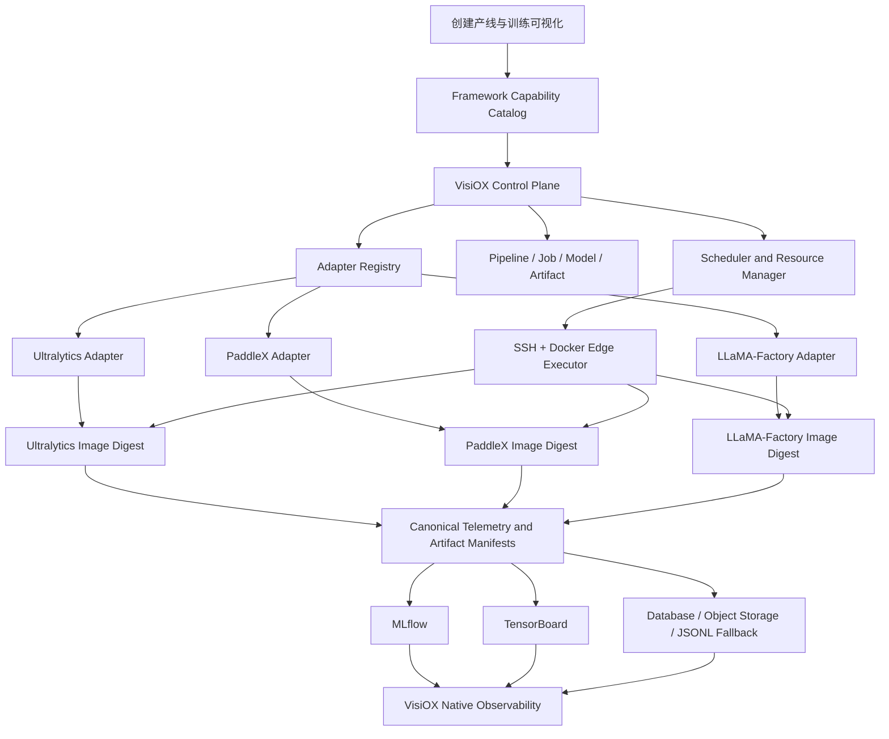

# VisiOX 多框架训练适配层设计

## 1. 文档状态

- 日期：2026-07-31
- 状态：设计已确认
- 适用范围：Ultralytics、PaddleX、LLaMA-Factory 的训练、评估、推理、部署与可观测性集成
- 首期新增范围：PaddleX 目标检测，模型为 PP-YOLOE-S 与 RT-DETR-L

## 2. 背景

VisiOX 当前已经接入：

- Ultralytics：计算机视觉训练、评估、在线推理和模型产物。
- LLaMA-Factory：大模型 SFT、LoRA、QLoRA 训练及其指标和检查点。
- MLflow、TensorBoard 和 VisiOX 原生训练可视化。

现有实现仍将框架逻辑分散在 API、Worker、边缘执行脚本和前端中。例如 `engine=yolo26` 同时承担框架、模型族和任务类型的含义，部分 API 直接导入 Ultralytics，边缘执行脚本按固定字符串分支。继续以这种方式接入 PaddleX 会造成以下问题：

1. 每增加一个框架都需要修改整条业务链。
2. 数据格式、参数、指标和产物缺少稳定边界。
3. 历史任务会受到框架升级和默认参数变化影响。
4. 不同框架的指标容易被错误地放到同一纵坐标或进行不公平比较。
5. 评估、在线推理和部署不能可靠地选择与训练任务一致的运行时。

本设计采用统一框架适配层。VisiOX 控制面只理解稳定的任务和资产契约，框架细节全部集中在可注册适配器及其固定摘要运行镜像中。

## 3. 目标

### 3.1 产品目标

- 用户先选择任务场景，再从兼容框架中选择 Ultralytics、PaddleX 或 LLaMA-Factory。
- 同一套创建产线、任务中心、模型空间和可视化页面服务所有框架。
- 产线在配置阶段允许切换框架，首次提交训练后锁定框架和适配器版本。
- 跨框架实验通过克隆产线创建，并可在统一对比页面比较同语义指标。
- PaddleX 首期完成目标检测的训练、可视化、评估、在线推理和导出部署闭环。

### 3.2 技术目标

- 消除 API、前端和边缘执行器中的框架命令拼接与散落分支。
- 冻结每次训练的模型、数据、参数、镜像、适配器和资源快照，保证可复现。
- 以结构化契约连接控制面、框架适配器和边缘执行器。
- 统一采集指标、日志、资源和产物，同时保留框架原始名称及来源。
- 框架运行时相互隔离，避免 PyTorch、PaddlePaddle、CUDA 和 Python 依赖冲突。

## 4. 非目标

- PaddleX 首期不接入图像分类、分割、OCR、文档理解或大模型训练。
- 不把 PaddleX 的全部检测模型一次性纳入首期验收。
- 不允许前端提交任意 Shell 命令、容器入口或宿主机路径。
- 不在 VisiOX 原生页面重做 TensorBoard 的计算图和直方图；需要深度调试时打开 TensorBoard。
- 不要求不同框架的专属损失函数可以横向比较。
- 不在本设计中替换现有 SSH + Docker 边缘执行路径。

## 5. 已确认的产品决策

1. 采用统一框架适配器注册表，不继续扩展散落的 `if/elif` 分支。
2. PaddleX 只用于计算机视觉任务；大模型训练继续使用 LLaMA-Factory。
3. PaddleX 首期只完成目标检测生产闭环。
4. PaddleX 首期模型为 PP-YOLOE-S 和 RT-DETR-L，分别覆盖轻量实时和高精度路线。
5. 产线第一次提交训练后，`task_kind`、`framework` 和 `adapter_key` 不可修改。
6. 修改框架时必须克隆产线，原产线及历史任务保持不变。
7. VisiOX 原生页面是默认可视化入口；MLflow 和 TensorBoard 是采集、存储和高级调试工具。
8. 同一张图只展示同语义、同单位且可比较的序列。

## 6. 总体架构



控制面负责能力发现、授权、任务快照、资源调度和状态管理。适配器负责将统一契约转换为框架操作。边缘执行器只接收结构化 `LaunchSpec`，不理解任何框架参数。

## 7. 核心领域模型

### 7.1 字段语义

框架、任务和模型必须分离：

| 字段 | 示例 | 说明 |
| --- | --- | --- |
| `task_kind` | `object_detection`、`llm_sft` | 用户要完成的任务 |
| `framework` | `ultralytics`、`paddlex`、`llamafactory` | 实现任务的框架 |
| `model_family` | `yolo26`、`PP-YOLOE`、`RT-DETR`、`Qwen` | 模型架构或模型族 |
| `adapter_key` | `paddlex.object_detection.v1` | 适配器唯一键 |
| `adapter_version` | `1.0.0` | 适配器实现版本 |
| `framework_version` | 框架固定版本 | 运行时框架版本 |
| `runtime_image_digest` | `sha256:...` | 实际运行镜像摘要 |

### 7.2 TrainingPipeline

`TrainingPipeline` 保存用户可编辑的产线配置：

- `task_kind`
- `framework`
- `adapter_key`
- `model_family`
- `recipe`
- `framework_locked_at`
- `first_submitted_job_id`

规则：

- 产线处于草稿或配置中且未提交过训练时，可以切换兼容框架。
- 首次成功创建训练任务时，在同一事务中写入 `framework_locked_at`。
- 锁定后不得修改任务、框架或适配器键。
- 用户需要更换框架时执行“克隆产线”，并保留 `cloned_from_pipeline_id`。

### 7.3 TrainingJob

每个训练任务保存不可变 `resolved_snapshot`：

```json
{
  "task_kind": "object_detection",
  "framework": "paddlex",
  "adapter_key": "paddlex.object_detection.v1",
  "adapter_version": "1.0.0",
  "framework_version": "pinned-version",
  "runtime_image_digest": "sha256:...",
  "model": {
    "family": "PP-YOLOE",
    "variant": "PP-YOLOE-S",
    "source": "official",
    "revision": "resolved-revision",
    "checksum": "sha256:..."
  },
  "dataset": {
    "dataset_id": "...",
    "manifest_uri": "...",
    "manifest_checksum": "sha256:...",
    "source_format": "coco",
    "resolved_format": "paddlex_detection"
  },
  "parameters": {},
  "resource_request": {},
  "allocation": {},
  "launch_spec_checksum": "sha256:..."
}
```

任务重试和断点恢复创建新的 `attempt`，不得覆盖旧 attempt 的日志、指标、状态和制品。

### 7.4 TrainedModel 与 Artifact

训练产物必须记录：

- 产生它的 `job_id`、`attempt_id` 和 `pipeline_id`
- `framework`、`adapter_key`、`model_family` 和模型格式
- 权重角色：`best`、`last`、`checkpoint`、`export`
- URI、大小、SHA-256 和创建时间
- 评估摘要和完整评估报告 URI
- 推理兼容性和部署兼容矩阵
- 用户标记名；标记名不修改物理文件名和哈希

## 8. Framework Capability Catalog

前端不得硬编码“目标检测等于 Ultralytics”或“大模型等于 LLaMA-Factory”。能力目录按以下维度返回结构化数据：

- 任务类型
- 框架及显示信息
- 支持的模型族、模型变体和预训练来源
- 可接受数据格式和可转换格式
- 参数 Schema、默认值、范围、帮助文本和高级分组
- CPU、CUDA、GPU 架构、显存和多卡要求
- 训练、停止、恢复、评估、推理、导出和部署能力
- 运行镜像摘要和兼容节点约束
- 可采集指标和可生成制品

建议 API：

```text
GET /api/capabilities/tasks
GET /api/capabilities/tasks/{task_kind}/frameworks
GET /api/capabilities/adapters/{adapter_key}
POST /api/capabilities/adapters/{adapter_key}/validate
```

能力目录由适配器注册信息生成，前端只渲染后端返回的兼容选择和 Schema。

## 9. 适配器边界

为避免形成单个巨型接口，将职责拆分为六类协议。

### 9.1 CapabilityAdapter

- 返回框架、任务、模型、参数、设备和生命周期能力。
- 解析推荐默认值。
- 校验模型、数据、参数和资源组合。
- 返回稳定、可本地化的字段 Schema。

### 9.2 DatasetAdapter

- 声明可直接接受和可转换的数据格式。
- 校验数据完整性、类别、标注和 split。
- 在任务专属工作目录中转换数据，不修改源数据集。
- 输出 `DatasetManifest`、转换日志和转换器版本。

### 9.3 TrainingAdapter

- 执行训练预检。
- 解析不可变配置。
- 生成结构化 `LaunchSpec`。
- 声明停止、恢复和检查点能力。
- 解析阶段、进度和完成状态。
- 收集训练权重与配置制品。

### 9.4 EvaluationInferenceAdapter

- 生成评估和推理 `LaunchSpec`。
- 将框架评估结果转换为规范任务指标。
- 返回结构化预测结果和后处理图像。
- 保持评估、推理使用与权重一致的框架和版本。

### 9.5 DeploymentAdapter

- 声明原始权重、ONNX、TensorRT 等导出能力。
- 生成导出和优化任务。
- 记录精度、动态尺寸、批处理和硬件兼容性。
- 输出部署清单，不直接操作服务列表业务状态。

### 9.6 ObservabilityAdapter

- 读取框架回调、CSV、JSON、TensorBoard event、stdout 和制品。
- 保留原始指标名，同时映射到规范指标名。
- 写入统一 `TelemetryEnvelope`。
- 解析框架分析制品及其显示类型。

适配器通过 `adapter_key` 注册。API、调度器和边缘执行器不得直接导入框架库。

## 10. 统一契约

### 10.1 DatasetManifest

至少包含：

- 数据集 ID、版本、所有者和来源 URI
- 源格式、目标格式和任务类型
- train、val、test 样本数
- 类别定义与映射
- 文件清单摘要与 SHA-256
- 转换器键、转换器版本和转换日志 URI

### 10.2 LaunchSpec

至少包含：

- 固定摘要镜像
- 受控入口和结构化参数
- 只读输入挂载与可写输出挂载
- CPU、内存、GPU、共享内存和超时要求
- 环境变量白名单
- 健康检查和进度文件位置
- 产物目录和日志目录

前端不能提交 `command`、任意环境变量、Docker socket 或宿主机绝对路径。

### 10.3 TelemetryEnvelope

```json
{
  "job_id": "...",
  "attempt_id": "...",
  "framework": "paddlex",
  "namespace": "eval",
  "canonical_name": "eval.detection.map_50_95",
  "raw_name": "bbox_mAP",
  "value": 0.428,
  "unit": "ratio",
  "split": "val",
  "step": 1800,
  "epoch": 18,
  "timestamp": "2026-07-31T10:00:00Z",
  "source": "paddlex_eval_json"
}
```

### 10.4 ArtifactManifest

至少包含：

- 产物类型、角色、格式、URI、大小和 SHA-256
- 产生阶段和产生时间
- 框架、模型和任务元数据
- 评估摘要
- 可下载、可推理、可导出和可部署能力
- 关联的日志、配置和报告

## 11. 创建产线交互

### 11.1 选择顺序

```text
任务场景 → 兼容框架 → 模型族/变体 → 数据集 → 参数 → 资源 → 提交
```

目标检测首期可选框架：

- Ultralytics：保持现有 YOLO26 能力。
- PaddleX：PP-YOLOE-S、RT-DETR-L。

大模型 SFT：

- LLaMA-Factory。

### 11.2 参数页面

- 公共参数放在稳定分组，例如训练轮数、批量大小、学习率、输入尺寸和随机种子。
- 框架专属参数由能力 Schema 渲染，在高级配置中按分组展示。
- 配置文件编辑器只允许编辑适配器 Schema 支持的字段。
- 前端修改字段和配置文件使用同一份结构化状态，禁止出现两套值。
- 参数校验同时包含字段级错误和跨字段、模型、数据、资源组合错误。

### 11.3 框架锁定

- 首次提交按钮旁明确提示提交后框架将锁定。
- 已锁定产线不显示可编辑框架控件。
- “使用其他框架”操作实际执行克隆，并跳转到新产线的框架选择步骤。

## 12. 运行镜像与边缘执行

每个框架使用独立、固定摘要训练镜像：

```text
visiox/ultralytics-training@sha256:<digest>
visiox/paddlex-training@sha256:<digest>
visiox/llamafactory-training@sha256:<digest>
```

要求：

- 镜像记录 Python、框架、CUDA、cuDNN 和关键依赖版本。
- 能力目录声明镜像支持的 GPU 架构、驱动和最低显存。
- 调度器只选择满足镜像和任务约束的在线节点。
- 边缘执行器验证镜像摘要和 `LaunchSpec` 校验和。
- 模型权重优先由执行节点下载和缓存，平台保存引用、revision 和文件清单摘要。
- 同一任务只能从同类兼容资源池选择节点；首期不在单任务中混用 Jetson 与 x86 GPU。

## 13. 生命周期与状态机

统一阶段：

```text
draft
  → queued
  → prechecking
  → dataset_preparing
  → image_pulling
  → runtime_preparing
  → training
  → evaluating
  → artifact_collecting
  → succeeded
```

停止路径：

```text
interruptible phase → stopping → stopped
```

失败路径：

```text
any active phase → failed
```

节点失联不能立即等同失败：

```text
active phase → reconciling → active | failed | stopped
```

恢复规则：

- 只有适配器声明支持检查点恢复且存在有效检查点时，前端才显示“恢复训练”。
- 恢复创建新 attempt，保留原 attempt。
- 镜像拉取、短暂网络和节点对账失败可按阶段重试。
- 数据、模型和参数不兼容属于不可重试错误，用户必须修改或克隆产线后重新提交。

## 14. 统一可视化训练

### 14.1 页面结构

所有框架使用相同页面入口：

1. 概览
2. 指标
3. 资源
4. 分析
5. 日志
6. 制品
7. 对比

概览固定展示：

- 任务阶段和进度
- 当前 epoch、step 和预计剩余时间
- 框架、模型、数据集、节点和 GPU
- 最新检查点和最佳权重
- MLflow、TensorBoard 和本地采集源可用性

### 14.2 指标目录

规范指标使用分层名称：

```text
train.loss.total
train.loss.box
train.loss.classification
train.optimization.learning_rate
eval.detection.precision
eval.detection.recall
eval.detection.map_50
eval.detection.map_50_95
eval.language.loss
eval.language.perplexity
system.gpu.utilization
system.gpu.memory_used
system.cpu.utilization
system.memory.used
```

每个指标同时保存：

- `canonical_name`
- `raw_name`
- `unit`
- `framework`
- `source`
- `split`
- `step`、`epoch` 和 `timestamp`

### 14.3 图表规则

- 默认每个语义指标使用独立图表。
- train/val 只有在同语义、同单位时才能放在同一图表。
- Precision、Recall、AP 和比例类指标使用固定 `0..1` 范围。
- Learning Rate 使用独立图表和科学计数格式。
- Loss 使用自动范围，不与质量指标共轴。
- GPU 利用率、显存、温度、功耗、CPU、内存、磁盘和网络按单位分组。
- 不认识单位的指标只和自身序列共轴。
- 图表必须响应容器变化，缩放和侧边栏变化不得破坏尺寸。

### 14.4 Ultralytics 指标与制品

- 训练：box loss、classification loss、DFL loss、learning rate。
- 验证：precision、recall、mAP50、mAP50-95。
- 分析：混淆矩阵、PR/F1/P/R 曲线、标签分布、训练批次和验证批次。
- 权重：best、last 和阶段检查点。

### 14.5 PaddleX 目标检测指标与制品

- 训练：总损失、模型提供的损失分量、learning rate。
- 验证：COCO AP、AP50、AP75、APS、APM、APL 和 AR。
- 分析：评估 JSON、预测样例和框架生成的报告。
- 权重：best、last 和受支持的阶段检查点。
- 原始指标映射由具体模型适配配置决定，不能假定 PP-YOLOE 与 RT-DETR 损失分量相同。

### 14.6 LLaMA-Factory 指标与制品

- 训练：train loss、learning rate、grad norm、epoch、step。
- 验证：eval loss。
- 性能：tokens/s、samples/s、runtime。
- perplexity 可由 eval loss 推导，但必须标记为派生指标。
- 制品：adapter、merged model、checkpoint、训练状态和完整配置快照。

### 14.7 MLflow、TensorBoard 与 VisiOX 职责

- 一个 VisiOX job attempt 对应一个 MLflow run。
- MLflow 保存解析后参数、规范与原始指标、标签和制品索引。
- TensorBoard 保存框架原生或 VisiOX callback 生成的标量 event，作为高级调试入口。
- VisiOX 原生页面通过自身 API 聚合展示，不抓取第三方前端页面。
- TensorBoard 中的计算图和直方图不复制到 VisiOX 原生页面。
- MLflow 或 TensorBoard 暂时不可用不能单独导致训练失败；指标先落本地 JSONL，再按策略补写。

### 14.8 跨框架比较

- 只比较相同任务、数据集版本和规范指标。
- 目标检测可比较 mAP50、mAP50-95、precision、recall、训练时长、吞吐和资源峰值。
- 不比较不同框架的专属 loss 数值。
- 比较页面显示模型、框架、参数、数据集校验和、节点和镜像摘要，避免脱离上下文排名。

## 15. 评估、推理与部署

### 15.1 评估

- 权重选择来源于当前产线训练产物或兼容官方预训练权重。
- 评估使用权重记录中的框架和适配器，不能由前端另选不匹配框架。
- 自定义数据集先经过相应 `DatasetAdapter` 校验和转换。
- 评估结果同时保存规范指标和完整框架报告。

### 15.2 在线推理

- 服务端根据 `ArtifactManifest` 选择推理适配器和运行镜像。
- 返回结构化预测、类别、置信度、坐标和后处理图像。
- 不同类别使用稳定可区分颜色，结果图支持适配窗口的放大查看。
- 推理错误返回框架、阶段、规范错误码和日志引用。

### 15.3 导出与部署

部署能力由 `DeploymentAdapter` 和产物兼容矩阵共同决定：

- 原始框架运行时
- ONNX
- TensorRT engine
- 其他框架明确支持的格式

TensorRT engine 与目标 GPU 架构、TensorRT 版本、精度、动态尺寸和最大批量绑定，不能把一台设备生成的 engine 无条件复制到另一台设备。部署记录必须保存构建环境和校验和。

## 16. 错误模型

标准错误至少包含：

```json
{
  "phase": "dataset_preparing",
  "framework": "paddlex",
  "adapter_key": "paddlex.object_detection.v1",
  "code": "PADDLEX_DATASET_CONVERSION_FAILED",
  "message": "验证集标注中存在未知类别 7",
  "retryable": false,
  "recovery": "修正标签映射并重新提交克隆任务",
  "raw_log_uri": "artifact://jobs/.../stderr.log"
}
```

要求：

- 用户界面显示简洁原因和恢复动作。
- 详细堆栈和 stdout/stderr 放在日志页，不强行塞入任务列表。
- 日志中的令牌、密码和凭据必须脱敏。
- 错误码由阶段和适配器定义，HTTP 层不得把所有问题转换成 `Internal Server Error`。

## 17. 安全与权限

- 能力目录只返回当前用户有权使用的模型、数据、节点和资源池。
- 训练、评估、推理、导出和部署均执行资源级授权。
- 运行镜像使用固定摘要，禁止浮动标签作为生产任务快照。
- 输入数据只读挂载，输出目录按 job attempt 隔离。
- 边缘执行命令来自受信适配器，不接受用户 Shell。
- 日志和制品继承产线可见性与所有权；公开配置不自动公开底层节点和凭据。

## 18. 兼容迁移

### 18.1 旧字段映射

```text
engine=yolo26
  → framework=ultralytics
  → adapter_key=ultralytics.object_detection.v1
  → model_family=yolo26

engine=llamafactory
  → framework=llamafactory
  → adapter_key=llamafactory.llm_sft.v1
```

### 18.2 迁移策略

- 新增字段通过 Alembic 正式迁移。
- 迁移期 API 双读：优先新字段，缺失时按旧字段映射。
- 新任务只写新结构，同时在必要兼容窗口内维护旧读模型。
- 历史任务不补造不存在的镜像摘要、模型校验和或指标。
- 旧任务缺少数据时前端显示“历史任务未记录”，不能生成模拟值。
- 适配完成后分阶段移除直接 Ultralytics import 和边缘字符串白名单。

## 19. PaddleX 首期验收范围

### 19.1 模型

- PP-YOLOE-S
- RT-DETR-L

### 19.2 数据

- 使用现有 VisiOX 已检验目标检测数据集。
- 支持 COCO 和 YOLO 来源数据，通过任务专属转换生成 PaddleX 所需结构。
- 不修改用户源数据集。
- 训练前展示转换后的 train、val、test 和类别统计。

### 19.3 功能闭环

1. 创建目标检测产线并选择 PaddleX。
2. 选择 PP-YOLOE-S 或 RT-DETR-L。
3. 选择真实数据集和兼容 GPU 节点。
4. 完成真实训练、停止和支持条件下的恢复。
5. 原生页面实时展示损失、COCO 指标、资源、阶段和日志。
6. 训练成功后登记真实权重、报告和预测样例。
7. 使用 best 或 last 权重完成真实评估。
8. 在线体验完成真实推理并返回结构化结果和图像。
9. 生成受支持的导出产物并进入统一部署流程。
10. 重启平台后任务、指标、日志、制品和服务状态仍可恢复和对账。

## 20. 测试策略

### 20.1 契约测试

- 三个适配器必须通过相同的能力、校验、启动、状态、指标、错误和制品契约测试。
- `LaunchSpec` 必须验证命令、挂载和环境变量白名单。
- 任务快照序列化后重新读取必须保持一致。

### 20.2 数据测试

- COCO、YOLO 到 PaddleX 数据的转换和类别映射。
- 空 split、缺失图片、未知类别、损坏标注和重复文件。
- 转换结果确定性和 manifest checksum 稳定性。

### 20.3 可观测性测试

- Ultralytics、PaddleX 和 LLaMA-Factory 原始指标到规范指标的映射。
- 同名不同单位不合并，同语义 train/val 正确配对。
- MLflow、TensorBoard 任一来源不可用时的降级和 JSONL 补写。
- 资源采样、日志轮询、停止轮询和陈旧响应保护。
- 图表首次打开、侧栏变化和浏览器缩放后尺寸正确。

### 20.4 生命周期测试

- 正常成功、用户停止、参数失败、数据失败、镜像拉取失败和节点失联对账。
- 框架首次提交后锁定。
- 克隆产线可切换框架且不影响源产线。
- 重试与恢复创建新 attempt，不覆盖历史记录。

### 20.5 真实环境验收

- PP-YOLOE-S 和 RT-DETR-L 各完成至少一次真实 GPU 训练。
- 使用同一已检验目标检测数据集进行真实评估和在线推理。
- 验证指标、日志、资源和产物全部来自真实任务。
- 验证平台和边缘端重启后的状态恢复。
- 验证导出格式与目标节点兼容性检查。

## 21. 完成标准

- 新增框架不需要修改 API 路由、任务中心和边缘执行器的框架分支。
- 前端框架和模型选择完全来自能力目录。
- 所有新训练任务拥有不可变、可追溯的运行快照。
- Ultralytics、PaddleX 和 LLaMA-Factory 使用同一生命周期和错误模型。
- 三套框架在 VisiOX 中共享页面结构，但保留各自正确的指标语义和制品。
- 不同单位指标不再共用纵坐标，跨框架只比较等价指标。
- PaddleX 的 PP-YOLOE-S 与 RT-DETR-L 完成训练、评估、推理和导出部署闭环。
- 历史 Ultralytics 和 LLaMA-Factory 产线继续可访问且不伪造缺失数据。
