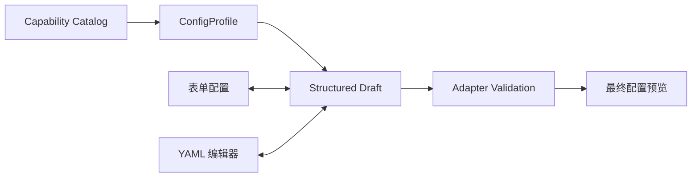

# VisiOX 目标检测原生训练配置设计

## 1. 文档状态

- 日期：2026-08-12
- 状态：设计已确认
- 适用范围：目标检测参数准备步骤
- 首期框架：PaddleX、Ultralytics
- 首期模型：能力目录中已注册并具有可用训练运行时的目标检测模型

## 2. 背景

VisiOX 当前已经能够根据目标检测任务选择 PaddleX 或 Ultralytics，并按框架展示兼容模型。现有参数配置仍存在三个问题：

1. 页面中的少量通用字段不足以覆盖真实框架能力。
2. 现有“配置文件”只是 VisiOX 自定义的扁平参数集合，不是框架原生配置。
3. 前端、API 和 Worker 对参数的理解可能不一致，导致页面上可修改的字段没有真正参与训练，或框架不支持的字段被静默忽略。

本设计将目标检测参数准备改造成与大模型训练一致的双模式配置：用户既可通过表单修改常用参数，也可通过 YAML 编辑框架和模型支持的高级参数。两种方式操作同一份配置，不形成两套互相覆盖的数据。

## 3. 目标

- PaddleX 和 Ultralytics 使用一致的参数准备交互。
- 参数配置由“框架 + 具体模型”共同决定，而不是使用一份跨模型固定表单。
- 表单配置覆盖常用参数，YAML 配置开放框架支持的高级训练参数。
- 表单与 YAML 双向同步，并有明确的冲突和错误处理规则。
- 数据集、输出路径、设备分配等平台托管字段不能被用户覆盖。
- 训练任务保存最终原生配置快照、模板版本与校验和，保证可复现。
- Worker 读取后端验证后的配置文件启动训练，不再依赖前端拼接命令。

## 4. 非目标

- 本设计不改变创建产线时的任务、框架和模型选择流程。
- 本设计不把 LLaMA-Factory 纳入本次实现；大模型训练继续使用已有参数页面。
- 本设计不一次性支持 PaddleX 的全部计算机视觉任务。
- 本设计不允许用户编辑任意 Shell 命令、容器入口、环境变量或宿主机路径。
- 本设计不保证不同框架拥有完全相同的参数集合。

## 5. 已确认的产品决策

1. 参数准备采用“表单配置 / YAML 配置”两个页签。
2. 表单和 YAML 操作同一份模型原生配置状态。
3. YAML 可编辑框架和模型支持的所有训练参数，只锁定平台托管字段。
4. 每个“框架 + 模型”保存独立草稿；切换回来时恢复原草稿。
5. 首次选择模型时加载固定版本的官方模板，再叠加 VisiOX 推荐默认值。
6. 草稿允许暂存无效 YAML，但无效配置不能进入下一步或提交训练。
7. 未知字段、错误类型和不支持组合必须明确报错，不能静默忽略。
8. 最终配置在服务端解析、合并、校验并冻结为不可变任务快照。

## 6. 页面设计

### 6.1 页面结构

参数准备页顶部显示只读摘要：

- 任务场景
- 训练框架
- 模型名称和模型版本
- 配置模板版本
- 当前草稿修改项数量

主体使用两个页签：

```text
参数准备
├── 表单配置
└── YAML 配置
```

右上角提供：

- 恢复推荐值
- 保存草稿
- 查看最终配置

“查看最终配置”展示服务端合并平台托管字段后的只读结果，避免用户只看到覆盖层却误以为那是完整运行配置。

### 6.2 表单配置

表单字段来自当前 `ConfigProfile`，按以下稳定分组显示：

1. 基础训练：轮数、批量大小、学习率、输入尺寸。
2. 数据性能：DataLoader Worker 数量、缓存、预取和框架支持的数据加载选项。
3. 训练稳定性：随机种子、AMP、预热、梯度累计、优化器和学习率策略。
4. 保存与评估：日志、保存、验证间隔，断点恢复和预训练权重策略。
5. 模型专属：只展示当前模型适配器声明支持的字段。

表单不为了视觉一致而伪造公共字段。例如 PaddleX 与 Ultralytics 的优化器、增强和调度器能力不同，页面应使用各自 Schema。

### 6.3 YAML 配置

YAML 页签编辑当前模型的完整原生训练配置：

- PaddleX 使用固定版本的 PaddleX 模型原生 YAML。
- Ultralytics 使用固定版本的 Ultralytics 训练配置 YAML。
- 编辑器显示行号、语法高亮、搜索、格式化和行级错误。
- 平台托管字段在编辑器中带锁定标记；修改时立即拒绝并恢复服务端值。
- 页面显示框架、模型、模板版本和模板摘要，避免用户误用另一模型的配置。

YAML 不是额外的“高级覆盖文本”。它与表单共享结构化配置树。表单修改会更新对应 YAML 路径；有效 YAML 修改会回填表单字段。

### 6.4 草稿切换

草稿键为：

```text
pipeline_id + framework + model_key + template_version
```

规则：

- 首次进入加载官方模板和 VisiOX 推荐值。
- 切换模型前自动保存当前草稿。
- 切回模型时恢复该模型草稿。
- 模板版本变化时不自动覆盖旧草稿，而是提示迁移或重置。
- 已提交任务始终读取自己的冻结快照，不受后续模板升级影响。

## 7. 配置模型

### 7.1 ConfigProfile

每个“框架 + 模型”提供一个 `ConfigProfile`：

```json
{
  "profile_key": "paddlex.PP-YOLOE-S.train.v1",
  "framework": "paddlex",
  "model_key": "PP-YOLOE-S",
  "framework_version": "pinned-version",
  "template_version": "sha256:...",
  "native_template": {},
  "recommended_overrides": {},
  "basic_fields": [],
  "managed_paths": [],
  "validation_schema": {},
  "cross_field_rules": []
}
```

`ConfigProfile` 由框架适配器提供，前端不硬编码模型参数。

### 7.2 基本字段映射

基本字段通过配置路径映射到原生配置。

PaddleX 示例：

| 表单字段 | 原生配置路径 |
| --- | --- |
| 训练轮数 | `Train.epochs_iters` |
| 批量大小 | `Train.batch_size` |
| 学习率 | `Train.learning_rate` |
| 预热步数 | `Train.warmup_steps` |
| 日志间隔 | `Train.log_interval` |
| 评估间隔 | `Train.eval_interval` |
| 保存间隔 | `Train.save_interval` |

Ultralytics 示例：

| 表单字段 | 原生配置路径 |
| --- | --- |
| 训练轮数 | `epochs` |
| 批量大小 | `batch` |
| 初始学习率 | `lr0` |
| 输入尺寸 | `imgsz` |
| DataLoader Worker | `workers` |
| 预热轮数 | `warmup_epochs` |
| 保存间隔 | `save_period` |

实际路径、类型、范围、枚举和帮助文本均以对应 `ConfigProfile` 为准。

### 7.3 平台托管字段

平台最终接管并锁定：

- 数据集根目录、训练/验证划分和类别定义
- 模型定义、官方预训练权重或恢复检查点的实际路径
- 输出目录、项目目录、任务名和 attempt 标识
- GPU 设备编号、节点分配、容器资源限额
- 框架入口、运行镜像和受控环境变量

DataLoader Worker 数量是用户可调训练参数，但必须在节点 CPU 分配允许范围内。它与平台 Worker、执行节点或训练容器实例不是同一概念。

## 8. 数据流与合并顺序

### 8.1 编辑过程



结构化草稿是有效配置的唯一事实来源。YAML 编辑器还保留当前文本缓冲区，用于保存语法尚未修复的草稿。

### 8.2 最终解析

服务端按以下顺序生成训练配置：

1. 固定版本的官方模型模板。
2. VisiOX 针对该模型的推荐默认值。
3. 用户通过表单或 YAML 产生的变更。
4. 平台根据数据集、模型、资源和任务生成的托管字段。
5. 框架适配器的完整校验与规范化。

合并结果保存为不可变 `resolved_native_config`，并计算 SHA-256。

### 8.3 训练任务快照

每个训练任务至少保存：

- `profile_key`
- 框架、框架版本和适配器版本
- 模型键、模型来源和版本
- 官方模板版本与摘要
- 用户修改路径和修改值
- 完整 `resolved_native_config`
- 配置 SHA-256
- 数据集、资源和运行镜像快照

任务重试和恢复继承原任务配置快照，除非用户明确创建新的训练任务。

## 9. 校验与冲突处理

### 9.1 校验层级

1. YAML 语法校验。
2. 字段存在性、类型、范围和枚举校验。
3. 模型专属约束校验。
4. 跨字段约束校验。
5. 数据集与类别约束校验。
6. 资源与参数组合校验。
7. 平台托管字段防篡改校验。

### 9.2 交互规则

- 表单字段失焦或修改时即时校验。
- YAML 输入停止约 500ms 后执行服务端校验。
- 有效 YAML 更新结构化草稿并回填表单。
- 无效 YAML 保留文本缓冲区和错误位置，不覆盖最后一份有效结构化配置。
- 当 YAML 缓冲区无效时，表单页展示“当前 YAML 尚未生效”。用户若继续修改表单，必须先确认丢弃无效 YAML 文本。
- 保存草稿允许无效 YAML；下一步、直接部署和提交训练必须使用有效配置。
- 未知字段返回明确的“不支持参数”错误及可用字段建议。
- 不允许把框架警告、未知字段或被忽略值当作成功。

## 10. API 边界

建议能力与配置 API：

```text
GET  /api/capabilities/adapters/{adapter_key}/models/{model_key}/config-profile
POST /api/capabilities/adapters/{adapter_key}/models/{model_key}/validate-config
POST /api/pipelines/{pipeline_id}/config-drafts
GET  /api/pipelines/{pipeline_id}/config-drafts/{profile_key}
POST /api/pipelines/{pipeline_id}/resolve-training-config
```

前端提交配置草稿或结构化配置，不提交训练命令。

校验响应至少包含：

```json
{
  "valid": false,
  "normalized_config": null,
  "errors": [
    {
      "path": "Train.batch_size",
      "line": 18,
      "code": "VALUE_OUT_OF_RANGE",
      "message": "批量大小超过当前模型和资源允许范围"
    }
  ],
  "warnings": []
}
```

## 11. 框架实现边界

### 11.1 PaddleX

- 模板来自固定 PaddleX 版本中与模型对应的原生配置文件。
- PP-YOLOE-S 与 RT-DETR-L 分别维护配置 Profile，不能共享一份任意 YAML。
- 适配器负责把数据、模型和输出等托管值写入正确原生路径。
- Worker 接收已解析配置文件，调用受控 PaddleX 入口。
- 现有扁平参数白名单仅作为兼容迁移输入，不再作为最终配置能力边界。

### 11.2 Ultralytics

- 模板来自运行镜像中固定 Ultralytics 版本的默认训练配置。
- Profile 根据目标检测任务和具体模型声明可用参数与约束。
- 适配器把平台托管值写入 `model`、`data`、`project`、`name`、`device` 等路径。
- Worker 使用解析后的配置文件或等价的受控结构化 API 调用，不接受用户 Shell 参数。
- `warmup_steps` 等非 Ultralytics 原生参数必须在校验阶段拒绝，不能再次进入命令行。

## 12. 错误处理

错误按来源分类：

- `CONFIG_YAML_SYNTAX_ERROR`
- `CONFIG_UNKNOWN_FIELD`
- `CONFIG_INVALID_TYPE`
- `CONFIG_VALUE_OUT_OF_RANGE`
- `CONFIG_MODEL_CONSTRAINT_FAILED`
- `CONFIG_RESOURCE_CONSTRAINT_FAILED`
- `CONFIG_MANAGED_FIELD_OVERRIDE`
- `CONFIG_TEMPLATE_VERSION_CONFLICT`

页面显示简短错误和修复建议，详细信息保留路径、行号、框架、模型和模板版本。提交阶段不能把配置错误转换成笼统的 `Internal Server Error`。

## 13. 兼容迁移

- 读取历史草稿时，将现有 `epochs`、`batch_size`、`learning_rate` 等字段映射到对应 Profile 路径。
- 历史 Ultralytics `advanced_yaml` 仅在字段全部合法时迁移；非法字段保留原文并标记需要修复。
- 历史 PaddleX 扁平配置映射到原生 PaddleX YAML；无法确定语义的字段不自动猜测。
- 已创建训练任务继续读取原有快照，不进行原地重写。
- 迁移窗口结束后，前端和 Worker 不再直接依赖旧扁平配置。

## 14. 测试策略

### 14.1 单元与契约测试

- 每个 Profile 的模板、字段路径、默认值和托管字段正确。
- 表单修改可稳定写入原生配置路径。
- YAML 修改可回填表单。
- PaddleX 与 Ultralytics 未知字段均被拒绝。
- 平台托管字段不能被表单、YAML 或直接 API 覆盖。
- 配置规范化和 SHA-256 在相同输入下保持稳定。

### 14.2 前端测试

- 切换框架和模型时保存并恢复独立草稿。
- 无效 YAML 显示行级错误且不污染最后有效配置。
- 无效配置不能下一步或提交。
- 恢复推荐值只影响当前 Profile。
- 缩放和侧边栏变化不破坏页签、编辑器和表单布局。

### 14.3 集成测试

- PP-YOLOE-S、RT-DETR-L 与至少一个 Ultralytics YOLO26 模型分别完成参数解析。
- Worker 实际读取冻结配置并反映表单/YAML 修改值。
- 最终任务快照包含完整原生配置与校验和。
- 配置错误在启动训练前被拦截。
- 真实短训练验证 epoch、batch、学习率、输入尺寸和模型专属参数确实生效。

## 15. 完成标准

- 目标检测参数准备拥有表单配置和 YAML 配置两个一致入口。
- PaddleX 与 Ultralytics 均使用框架原生、模型专属配置模板。
- 表单和 YAML 双向同步且不存在两套值。
- 用户可编辑框架支持的高级参数，但不能覆盖平台托管字段。
- 参数 Schema 与模板来自适配器能力目录，前端不硬编码模型参数。
- 后端在提交前完成完整校验并生成不可变配置快照。
- Worker 读取验证后的配置文件，所有页面参数都能在真实训练中得到证明。
- 未知或不支持参数明确失败，不再被静默忽略。
